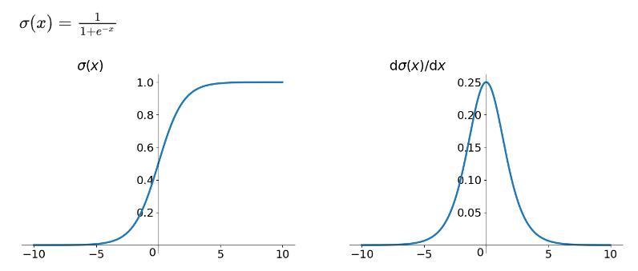
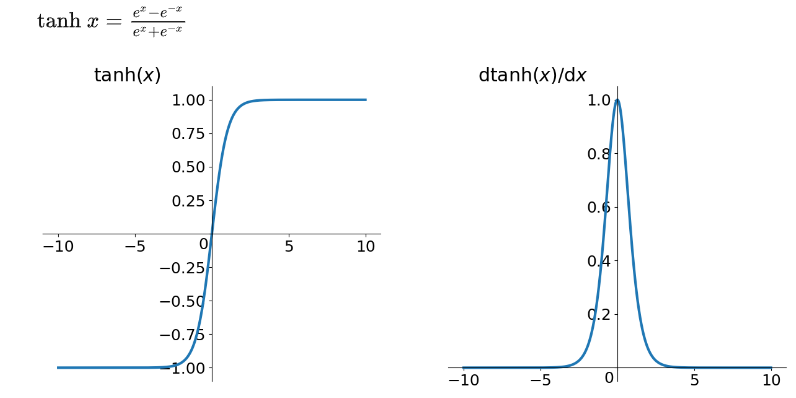
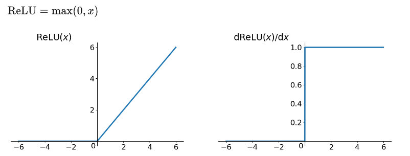

# 激活函数

激活函数是一种非线性函数，将输入信号（经过加权和）转换为输出信号，用于在神经网络中引入非线性因素。
目的： 引入非线性因素，提高模型的表达能力。 如果没有激活函数，模型就是线性模型。线性模型能表达的空间是有限的，激活函数引入了非线性因素，扩展了模型空间。

## [sigmoid 函数](https://zhuanlan.zhihu.com/p/25110450)

存在的三个缺点：

1. 容易出现gradient vanishing;

2. 函数输出并不是zero-centered;

3. 幂函数相对来讲比较耗时;

说明：

* Gradient vanishing

    sigmoid 函数在深度网络中常常会导致导数变为0， 使得参数无法更新，神经网络无法优化。主要原因如下：

    * 当输入较大或较小时， 导数接近0，而后向传递的数学依据是微积分求导的链式法则，当前层的导数需要和前几层的导数的乘积相乘，几个小数的相乘，结果会很大接近0；

    * sigmoid函数的导数最大值是0.25， 这意味着导数在每一层至少会被压缩为原来的1/4。

* [zero-centered](https://liam.page/2018/04/17/zero-centered-active-function/)

## tanh函数

tanh读作Hyperbolic Tangent，如上图所示，它解决了zero-centered的输出问题，然而，gradient vanishing的问题和幂运算的问题仍然存在。

## ReLU 函数

ReLU寒素其实就是一个取最大值的函数，注意这并不是全区间可导的。其中优点如下：

* 解决了gradient vanish问题（在正区间）；

* 计算速度非常快， 只需要判断输入是否大于0；

* 收敛速递远快于sigmoid 和tanh；

但是ReLU 也有几个需要特别注意的问题:

* ReLU的输出不是zero-centered;

* Dead ReLU Problem， 指的是某些神经元可能永远不会被激活，导致相应的参数永远不能被更新。可能存在的原因如下：

    * 非常不幸的参数初始化；

    * learning rate 太高导致在训练过程中参数更新太大，进入这种状态；

解决方法是可以采用Xavier初始方法，以及避免将learning rate 设置太大或使用adagrad等自动调节learning rate 的算法。