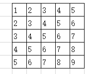
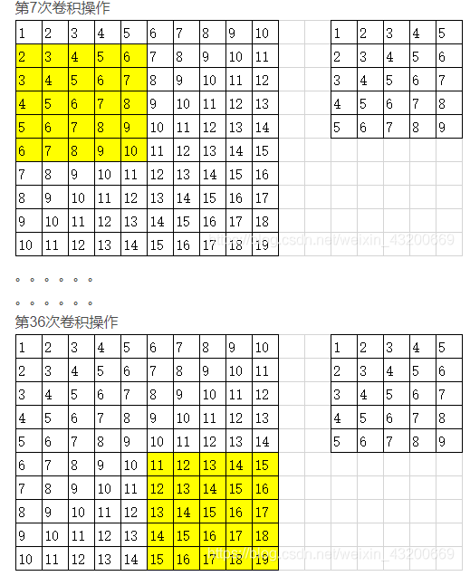

# 卷积

## 补充知识： 卷积神经网络中的“神经元” 以及“连接数”

输入图片是单通道的图片，没有rgb3个颜色，只有灰色。图片尺寸是10*10

单层神经网络，且只有1个卷积核，尺寸为5*5，卷积步长为1，即向右向下移动一格。

卷积操作：

因此：
* `总计实现了36次卷积操作，即该层神经网络有36个神经元。`；

* `单次卷积操作中，乘积的个数是5*5（kernel size），加上阈值，总共26个值，称之为连接数。 单个神经元的连接数是26， 36个神经元的连接数为26*36=936` 

* 若卷积核的数量变成2了，神经元的数量则是36*2=72， 神经元的连接数是72*26 = 1872