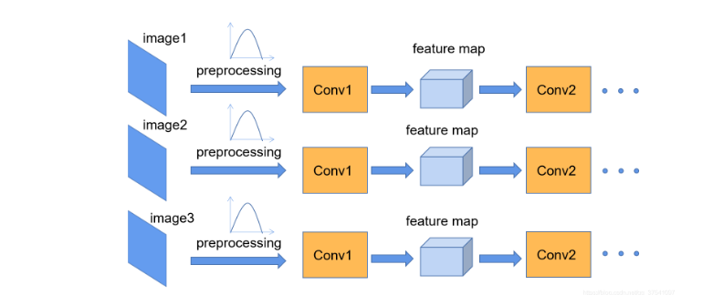
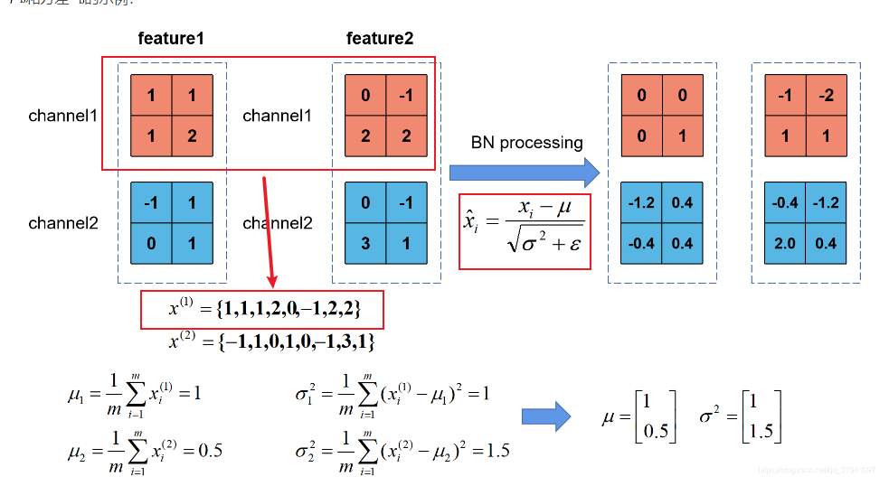
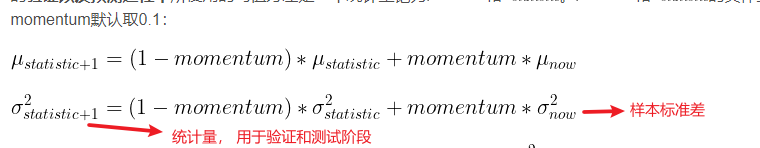

# Normalization summary

## batch normalization

图像预处理过程中会对图像进行标准化处理，能够加速网络的收敛。

网络输入经过卷积输出的feature map 不一定能够满足某种分布规律了， 而Batch Normalization 的目的就是使我们的feature map 满足均值为0，
方差为1的分布规律。

Batch Normalization 计算流程：

在一个batch内（mini-batch）， 对batch内的所有样本**根据通道**分别计算出对应的均值和方差，并更新每个通道上的数值。

在训练过程中， 不断计算每个batch的均值和方差，并使用移动平均的方法记录统计的均值和方差，在训练完后我们可以近似认为所统计的均值和方差等于整个训练集的均值和方差。

**解释了验证时 batch normalization 的参数和 每一个mini-batch 都有关**

需要注意的是：
* 在pytorch中对当前批次feature 进行bn处理时所使用的方差是总体标准差；

* 在更新统计量时采用的方差是样本标准差；

### 注意事项：

* 训练时要将training 参数设置为True， 验证时要将training参数设置为False；

* batch size 尽可能设置大些，设置小后表现可能糟糕。设置的越大求的均值和方差越接近整个训练集的均值和方差；

* 建议将bn层 放在卷积层和激活层之间， 且卷积层不需要设置bias。

## Layer Normalization

Layer Normalization 是针对自然语言处理提出来的， 主要是考虑到输入的长度不是一个定值（每句话的长短不一定相同，很难使用BN）。

LN 主要是对单个数据的指定维度进行Norm 处理，与batch 无关。

## Group Normalization